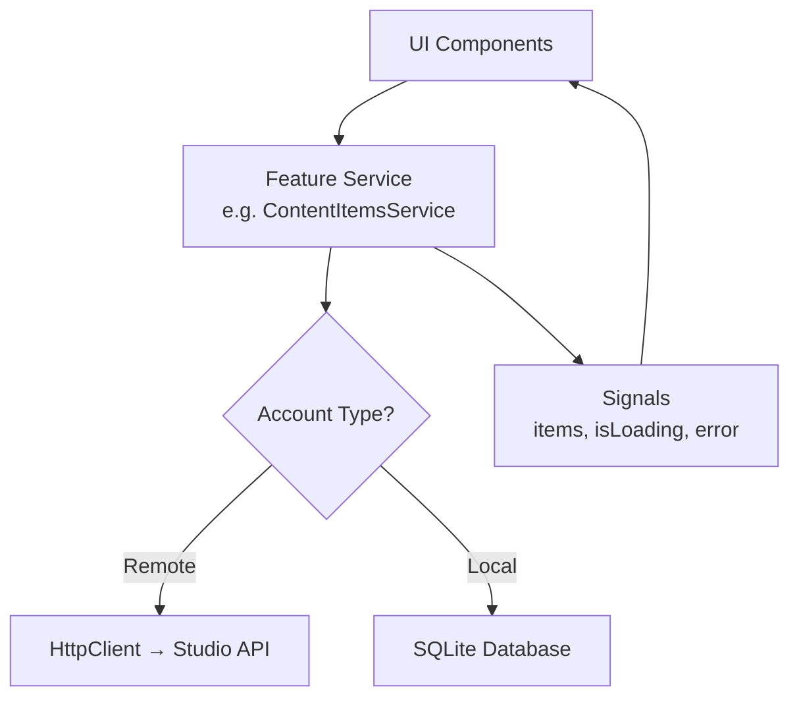

The data service layer is the core abstraction that makes dual-mode possible. UI components consume **typed services with signal-based state** — they never know whether data comes from a remote API or a local database.

## Pattern Overview



Every feature service follows the same pattern:

1. **Private writable signals** for state
2. **Public readonly signals** for components to consume
3. **Async methods** that fetch data, update signals, and handle errors
4. **`getBaseUrl()` / `getManageUrl()`** that returns the correct API endpoint based on the active account

## Service Structure

```typescript
@Injectable({ providedIn: 'root' })
export class ContentItemsService {
  private readonly http = inject(HttpClient);
  private readonly account = inject(AccountService);
  private readonly config = inject(ConfigService);

  // Private writable signals
  private readonly _items = signal<ContentItem[]>([]);
  private readonly _isLoading = signal(false);
  private readonly _total = signal(0);

  // Public readonly signals
  readonly items = this._items.asReadonly();
  readonly isLoading = this._isLoading.asReadonly();
  readonly total = this._total.asReadonly();
  readonly hasMore = computed(() => this._items().length < this._total());

  // Dynamic base URL based on active account
  private getManageUrl(): string {
    const activeAccount = this.account.activeAccount();
    if (activeAccount?.type === 'remote' && activeAccount.studioUrl) {
      return `${activeAccount.studioUrl}/api/v1/manage`;
    }
    return `${this.config.get('contextDirectoryUrl')}/manage`;
  }

  async loadItems(params: ContentListParams): Promise<void> {
    this._isLoading.set(true);
    try {
      const url = this.getManageUrl();
      const raw = await firstValueFrom(
        this.http.get<any>(`${url}/content`, { params })
      );
      const res = raw?.data ?? raw;
      const items = Array.isArray(res) ? res : (res?.items ?? []);
      this._items.set(items);
      this._total.set(raw?.meta?.total ?? res?.total ?? items.length);
    } catch {
      this._items.set([]);
    } finally {
      this._isLoading.set(false);
    }
  }
}
```

## API Response Unwrapping

The Studio API wraps all responses in a `{ data: ..., meta: ... }` envelope via its `TransformInterceptor`. All services handle this by unwrapping with `raw?.data ?? raw`, making them compatible with both wrapped (Studio) and unwrapped (direct API) responses.

```typescript
// Handles both { data: [...], meta: { total: 100 } } and plain [...]
const raw = await firstValueFrom(this.http.get<any>(url));
const result = raw?.data ?? raw;
```

## All Data Services

### Consumer Services

| Service | Signals | Remote Endpoint | Local Source |
|---------|---------|-----------------|-------------|
| `DiscoverStateService` | `results`, `facets`, `suggestions`, `isLoading` | `POST /consumer/discover/search` | Discovery Node HTTP |
| `GoalsService` | `goals`, `categories`, `templates`, `isLoading` | `GET/PUT /consumer/goals/*` | Context Directory HTTP |
| `BookmarksService` | `bookmarks`, `collections`, `isLoading` | `GET/POST/DELETE /consumer/bookmarks/*` | localStorage + CD sync |
| `PublishersService` | `publishers`, `detail`, `isLoading` | `GET /consumer/publishers/*` | Discovery Node HTTP |
| `FollowsService` | `followedIds`, `followCount` | `GET/POST/DELETE /consumer/follows/*` | localStorage + CD sync |
| `NotificationsService` | `notifications`, `unreadCount`, `isLoading` | `GET /consumer/notifications/*` | SQLite `notifications` |

### CMS Services

| Service | Signals | Remote Endpoint | Local Source |
|---------|---------|-----------------|-------------|
| `ContentItemsService` | `items`, `activeItem`, `isLoading`, `saving` | `GET/POST/PUT/DELETE /manage/content/*` | SQLite `content` |
| `ContentTypesService` | `contentTypes`, `isLoading` | `GET /manage/content-types/*` | SQLite `schemas` + Schema Registry |
| `AssetsService` | `assets`, `isLoading` | `GET/POST/DELETE /assets/*` | SQLite `media` + filesystem |
| `PublishingService` | `activeJob`, `jobHistory`, `isPublishing` | `POST /manage/publishing/*` | Local pipeline + DN HTTP |

### Infrastructure Services

| Service | Signals | Description |
|---------|---------|-------------|
| `AccountService` | `accounts`, `activeAccount` | Multi-account management |
| `AuthService` | `user`, `isAuthenticated`, `isLoading` | Authentication state |
| `NetworkService` | `isOnline` | Connectivity monitoring |
| `SyncService` | `pendingCount`, `isSyncing` | Offline queue management |
| `ThemeService` | `theme` | Light/dark/system |
| `I18nService` | `locale`, `translations` | Internationalization |

## Optimistic Updates

Services that modify data use **optimistic updates** — the UI updates immediately while the API call happens in the background. If the call fails, the state is rolled back:

```typescript
async deleteItem(id: string): Promise<void> {
  const prev = this._items();  // Save previous state
  this._items.update(items => items.filter(i => i.id !== id));  // Optimistic

  try {
    await firstValueFrom(this.http.delete(`${url}/content/${id}`));
    this.toast.info('Content deleted');
  } catch {
    this._items.set(prev);  // Rollback on failure
    this.toast.error('Failed to delete');
  }
}
```

This pattern is used across bookmarks, follows, content items, collections, and notifications.

## Computed Signals

Services expose **computed signals** for derived state, which automatically update when their dependencies change:

```typescript
// BookmarksService
readonly bookmarkedTeaserIds = computed(() =>
  new Set(this._bookmarks().map(b => b.teaserId))
);

// GoalsService
readonly filteredGoals = computed(() => {
  const horizon = this._activeHorizonFilter();
  if (horizon === 'all') return this._goals();
  return this._goals().filter(g => g.timeHorizon === horizon);
});

// NotificationsService
readonly unreadCount = computed(() =>
  this._notifications().filter(n => !n.read).length
);
```

## SQLite Schema (Local Mode)

The local SQLite database contains tables for all data types:

| Table | Purpose |
|-------|---------|
| `content` | Content drafts and published items |
| `content_versions` | Version history snapshots |
| `media` | Local media files with upload status |
| `media_variants` | Thumbnails and resized variants |
| `content_media` | Content-to-media relationships |
| `schemas` | Cached content type schemas |
| `goals` | Goals synced from Context Directory |
| `bookmarks` | Saved content references |
| `bookmark_collections` | Bookmark collections |
| `follows` | Followed publisher IDs |
| `notifications` | Local notification store |
| `sync_queue` | Offline operation queue |
| `settings` | User preferences and app settings |
| `discovery_nodes` | Configured Discovery Node endpoints |
| `content_pod_config` | Content Pod connection settings |
| `content_fts` | FTS5 virtual table for full-text search |
