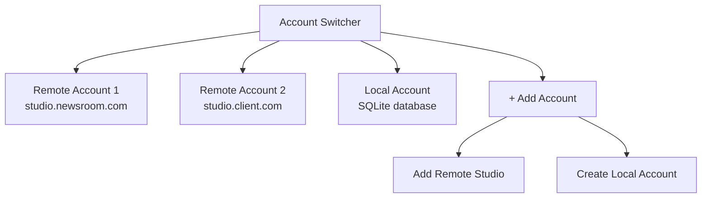

The roadbeat Mobile App supports **multiple accounts** simultaneously. Users can connect to several remote Studio instances and also maintain local standalone accounts, switching between them at any time.

## Account Model

Each account stores connection details and authentication tokens:

```typescript
interface Account {
  id: string;                    // UUID
  label: string;                 // User-chosen name ("My Newsroom", "Personal")
  type: 'remote' | 'local';

  // Remote mode
  studioUrl?: string;            // e.g. "https://studio.mynewsroom.com"
  email?: string;
  accessToken?: string;          // JWT in Secure Storage
  refreshToken?: string;

  // Local mode
  cdUserId?: string;             // Context Directory user ID
  cdAccessToken?: string;
  displayName?: string;

  // Common
  avatarUrl?: string;
  createdAt: string;
  lastActiveAt: string;
  onboardingComplete: boolean;
}
```

## Account Switcher

The Account Switcher is the first screen users see. It lists all configured accounts with the active one highlighted:



### Adding a Remote Account

<Steps>
  <Step title="Enter Studio URL">
    The user enters the URL of their Studio instance (e.g., `https://studio.example.com`). The app validates the connection by calling the Studio's health endpoint.
  </Step>
  <Step title="Authenticate">
    The user logs in with their Studio credentials. The app receives a JWT access token and refresh token, stored securely via Capacitor Secure Storage.
  </Step>
  <Step title="Save Account">
    The account is saved to the master accounts database with the Studio URL, email, and tokens.
  </Step>
</Steps>

### Adding a Local Account

<Steps>
  <Step title="Register with Context Directory">
    The user creates an account via the Context Directory API, providing a display name, email, and password.
  </Step>
  <Step title="Create Local Database">
    A per-account SQLite database is created (`roadbeat_{accountId}.db`) with the full schema for content, media, goals, bookmarks, and more.
  </Step>
  <Step title="Complete Onboarding">
    The user goes through the onboarding wizard to set their location and initial goals.
  </Step>
</Steps>

## Account Switching

When switching accounts, the app performs these steps:

<Steps>
  <Step title="Preserve current state">
    Current account's tokens and last viewed page are saved.
  </Step>
  <Step title="Re-initialize data layer">
    All data services re-initialize to point at the new account's backend (remote API or local SQLite).
  </Step>
  <Step title="Reset signals">
    All state signals reset to their loading state, triggering fresh data fetches.
  </Step>
  <Step title="Navigate">
    The router navigates to the new account's last active tab.
  </Step>
  <Step title="Verify authentication">
    For remote accounts, the JWT is verified and refreshed if needed. For local accounts, the correct SQLite database is opened.
  </Step>
</Steps>

## Storage Architecture

Accounts use a **master + per-account** database pattern:

```
Device Storage:
├── roadbeat_accounts.db         # Master: account list, active account, tokens
├── roadbeat_{localId1}.db       # Local account 1: content, media, schemas, etc.
├── roadbeat_{localId2}.db       # Local account 2 (if multiple)
└── media/
    ├── {localId1}/              # Local account 1 media files
    └── {localId2}/              # Local account 2 media files
```

- The **master database** is always available regardless of the active account
- Each **local-mode account** gets its own SQLite database with the full schema
- **Remote-mode accounts** don't need a local database (optional offline cache)
- **Media files** are stored per-account in the device filesystem

## Guards

Three route guards protect the authenticated sections of the app:

| Guard | Purpose | Redirect |
|-------|---------|----------|
| `AccountGuard` | Ensures an active account is selected | → Account Switcher |
| `AuthGuard` | Ensures the user is authenticated | → Login page |
| `OnboardingGuard` | Ensures onboarding is complete | → Onboarding wizard |

```typescript
// Route protection
{
  path: 'tabs',
  canActivate: [accountGuard, authGuard],
  children: [ /* ... */ ]
}
```

## Account Deletion

When an account is removed:

1. A confirmation dialog is shown
2. Tokens are cleared from Secure Storage
3. For local accounts, the per-account SQLite database is deleted
4. Media files for the account are removed from the filesystem
5. The account entry is removed from the master database
6. If it was the active account, the user is redirected to the Account Switcher
