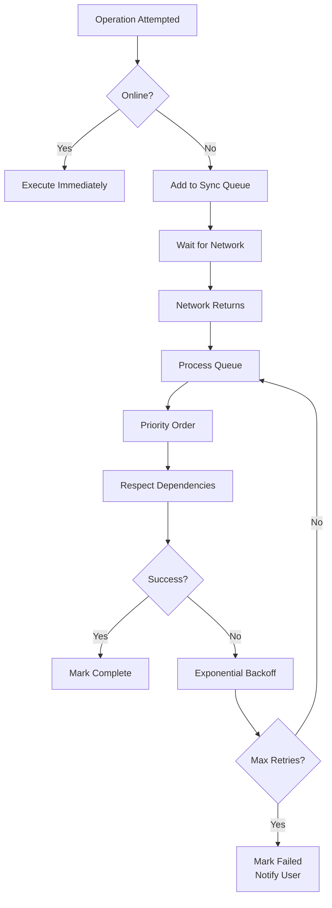
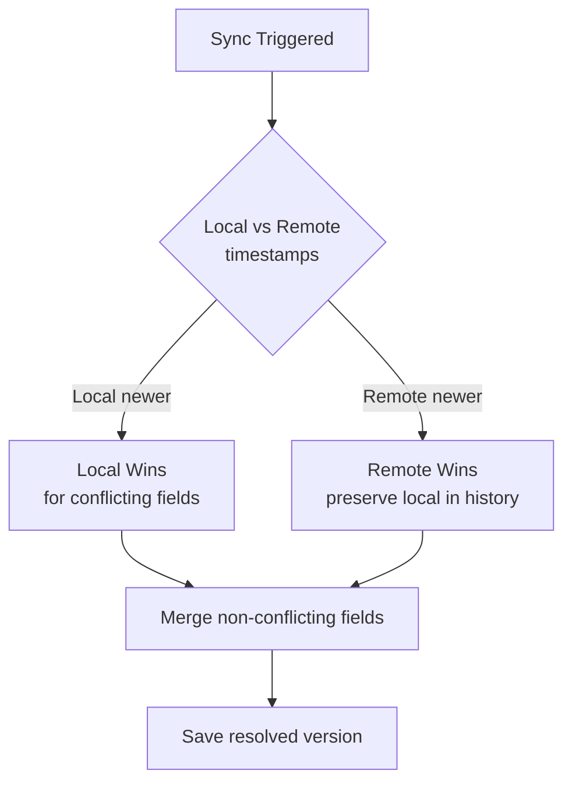
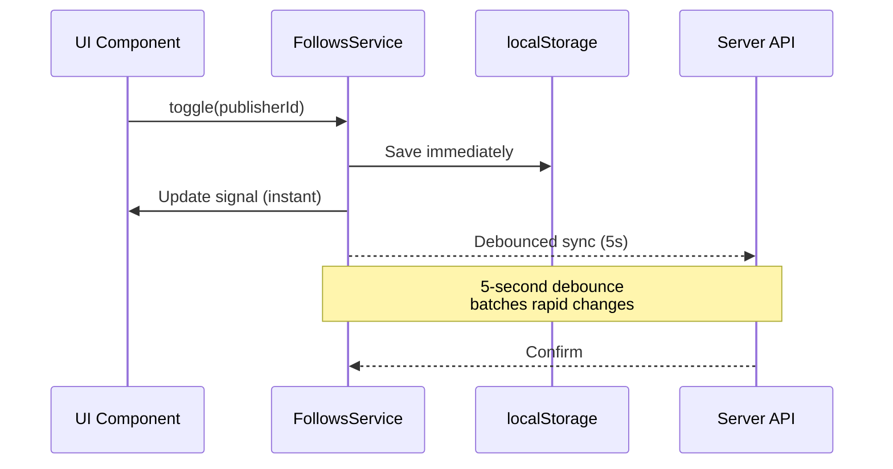

The roadbeat Mobile App is designed with an **offline-first** approach. Users can create and edit content, capture media, and manage bookmarks without a network connection. All pending operations are queued and automatically processed when connectivity returns.

## Offline Capabilities

### Always Available Offline

These features work without any network connection:

- Create and edit content drafts (local SQLite)
- Capture photos and videos (camera → device filesystem)
- Browse the local media library
- View cached content type schemas
- Browse locally cached content
- Manage goals (from local cache)
- View cached bookmarks and follows

### Requires Network (Queued When Offline)

These operations are queued in the sync queue and processed when the device comes online:

- Publish to Discovery Nodes
- Upload to Content Pod
- Fetch new schemas from Schema Registry
- Sync goals with Context Directory
- Sync bookmarks/follows with Context Directory
- Search Discovery Nodes

## Network Detection

The `NetworkService` wraps the Capacitor Network plugin and exposes a signal-based `isOnline` state:

```typescript
@Injectable({ providedIn: 'root' })
export class NetworkService {
  private readonly _isOnline = signal(true);
  readonly isOnline = this._isOnline.asReadonly();

  constructor() {
    Network.addListener('networkStatusChange', (status) => {
      this._isOnline.set(status.connected);
    });
  }
}
```

Components and services can react to connectivity changes:

```typescript
// In a service
if (!this.network.isOnline()) {
  this.syncService.enqueue(operation);
  return;
}
```

## Sync Queue

The `SyncService` manages an offline operation queue. When operations can't be completed due to no network, they're added to a persistent queue (SQLite `sync_queue` table in local mode, in-memory in remote mode).



### Queue Item Structure

```typescript
interface SyncQueueItem {
  id: string;
  operationType: string;     // publish, upload_media, sync_goals, etc.
  resourceType: string;
  resourceId: string;
  payload: Record<string, unknown>;
  priority: number;           // Higher = processed first
  status: 'pending' | 'processing' | 'completed' | 'failed';
  retryCount: number;
  maxRetries: number;         // Default: 3
  createdAt: string;
  lastAttempt?: string;
  nextAttempt?: string;
  errorMessage?: string;
  dependsOn?: string;         // ID of another queue item
}
```

### Processing Order

Queue items are processed by:

1. **Priority** — Higher priority items first (e.g., media uploads before teaser pushes)
2. **Dependencies** — Items with `dependsOn` wait for their dependency to complete
3. **Creation time** — FIFO within the same priority level

### Retry Strategy

Failed operations use **exponential backoff**:

| Retry | Delay | Total Wait |
|-------|-------|------------|
| 1st | 2 seconds | 2s |
| 2nd | 4 seconds | 6s |
| 3rd | 8 seconds | 14s |

After 3 failed retries, the item is marked as `failed` and the user is notified. They can then:

- **Retry** — Reset the retry count and attempt again
- **Discard** — Remove the failed item from the queue

## Background Sync

The app uses **Capacitor Background Runner** for periodic synchronization tasks that run even when the app is in the background:

| Task | Frequency | Description |
|------|-----------|-------------|
| **Goal sync** | Every 30 minutes | Sync goals with Context Directory |
| **Bookmark/follow sync** | Every 30 minutes | Sync bookmarks and follows with CD |
| **Schema cache refresh** | Every 24 hours | Check for content type schema updates |
| **Notification poll** | Every 5 minutes | Check for new notifications |

## Conflict Resolution

When syncing data that may have been modified on both the device and server, the app uses a **last-write-wins** strategy with field-level merging:



For content items specifically:

- **Drafts** — Local always wins (user's latest edits take priority)
- **Published content** — Server version is authoritative
- **Bookmarks/follows** — Union merge (keep both local and server additions)
- **Goals** — Server version from Context Directory is authoritative

## Sync Status Indicator

The app header displays a sync status indicator showing:

- **Green checkmark** — All synced, no pending items
- **Orange spinner** — Sync in progress
- **Red badge** — Failed items requiring attention

Users can tap the indicator to open the **Sync Page** (`/tabs/sync`) which shows:

- Pending operation count
- Currently processing item
- Failed items with retry/discard options
- Last successful sync timestamp

## Follows & Bookmarks Sync

The `FollowsService` and `BookmarksService` use a **localStorage-primary + server-sync** pattern:



- Changes are saved to localStorage **instantly** (no perceived latency)
- A 5-second debounced sync pushes changes to the server
- On app startup, localStorage is loaded first, then merged with server state
- Union merge ensures no data loss: `local ∪ server`
