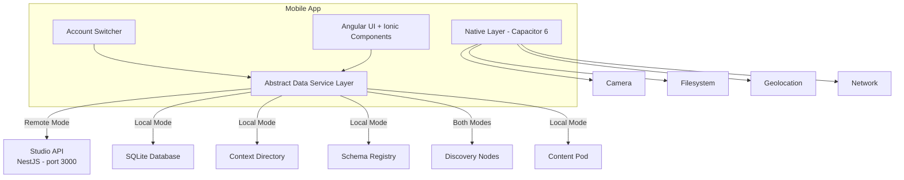
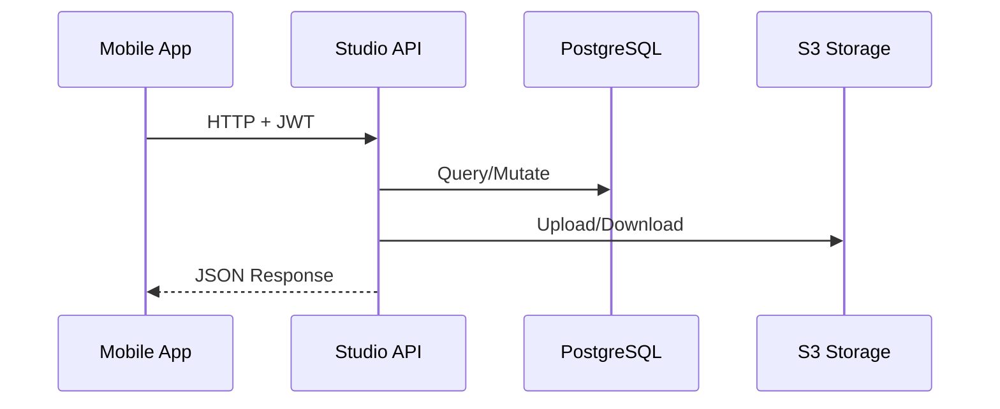
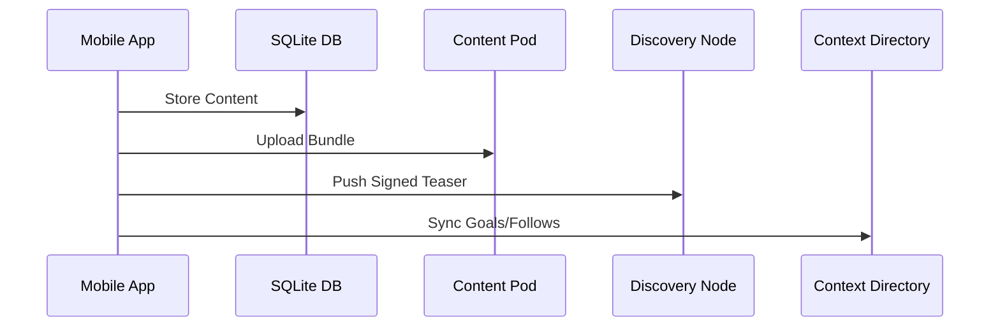

The roadbeat Mobile App is built on a **dual-mode architecture** where the same UI code operates against either a remote Studio API or a local SQLite database, depending on the active account type.

## High-Level Architecture



## Remote Mode

In remote mode, the app acts as a mobile frontend for an existing roadbeat Studio instance. All business logic, database operations, and external integrations run on the Studio server.



**Characteristics:**
- All CRUD via Studio REST API (`/api/v1/*`)
- Pro plugin features via `pro/*` endpoints
- Pro plugin UIs loaded as Web Components from Studio
- Multi-user, multi-organization capabilities
- JWT stored in Capacitor Secure Storage

## Local Mode

In local mode, the app operates as a standalone fat-client. Content is stored in a local SQLite database, and publishing goes directly to Content Pods and Discovery Nodes.



**Characteristics:**
- Full offline content creation and editing
- SQLite FTS5 for local full-text search
- Ed25519 key pair for content signing
- Sync queue for offline operations
- Single-user (no team features)

## Technology Stack

| Layer | Technology | Version |
|-------|------------|---------|
| **UI Framework** | Angular | 19.x |
| **Mobile Toolkit** | Ionic | 8.x |
| **Native Bridge** | Capacitor | 6.x |
| **Styling** | Tailwind CSS | 3.4 |
| **State Management** | Angular Signals | — |
| **Local Database** | SQLite (Capacitor SQLite) | — |
| **Local Search** | SQLite FTS5 | — |
| **Icons** | Ionicons + Lucide | — |
| **i18n** | Custom signal-based I18nService | 24 EU locales |

## Key Architecture Decisions

| Decision | Rationale |
|----------|-----------|
| **Standalone components** | Matches desktop Studio, tree-shakeable, Angular 19 best practice |
| **Signal-based state** | 1:1 with desktop Studio pattern, simpler than NgRx |
| **Abstract data services** | Same UI code works against remote API or local SQLite |
| **Ionic 8 components** | Native-feeling UI on both platforms with haptic feedback |
| **Tailwind CSS** | Consistent styling system with desktop Studio |
| **Lazy-loaded routes** | Fast initial load, features loaded on demand |

## Routing Structure

The app uses a tab-based navigation with lazy-loaded feature routes:

```typescript
const routes: Routes = [
  { path: 'accounts', loadComponent: () => import('./features/accounts/...') },
  { path: 'auth', loadChildren: () => import('./features/auth/...') },
  { path: 'onboarding', loadComponent: () => import('./features/onboarding/...') },
  {
    path: 'tabs',
    canActivate: [accountGuard, authGuard],
    children: [
      { path: 'compass', loadComponent: () => import('./features/compass/...') },
      { path: 'discover', loadComponent: () => import('./features/discover/...') },
      { path: 'create', loadComponent: () => import('./features/quick-create/...') },
      { path: 'content', loadComponent: () => import('./features/content/...') },
      { path: 'profile', loadComponent: () => import('./features/profile/...') },
      { path: 'detail/:teaserId', loadComponent: () => import('./features/content-detail/...') },
      { path: 'publishers', loadComponent: () => import('./features/publishers/...') },
      { path: 'bookmarks', loadComponent: () => import('./features/bookmarks/...') },
      { path: 'notifications', loadComponent: () => import('./features/notifications/...') },
      { path: 'publishing', loadComponent: () => import('./features/publishing/...') },
      { path: 'settings', loadComponent: () => import('./features/profile/settings...') },
      { path: 'pro/:pluginId', loadComponent: () => import('./features/pro/...') },
    ]
  }
];
```

## Bottom Tab Navigation

The app shell provides five primary tabs:

| Tab | Icon | Purpose |
|-----|------|---------|
| **Compass** | 🧭 | Goal management — categories, templates, time horizons |
| **Discover** | 🔍 | Content discovery — search, filters, view modes |
| **Create** | ➕ | Quick capture — type selector, camera, fast publish |
| **Content** | 📄 | Content management — list, editor, types, assets |
| **Profile** | 👤 | Profile, settings, accounts, notifications |

## Core Services

| Service | Scope | Description |
|---------|-------|-------------|
| `AccountService` | Root | Multi-account CRUD, active account signal, switching |
| `AuthService` | Root | Login, register, JWT management, refresh |
| `DatabaseService` | Root | SQLite initialization, query/run helpers |
| `NetworkService` | Root | Online/offline detection via Capacitor Network |
| `ConfigService` | Root | App configuration, feature flags |
| `ToastService` | Root | Signal-based notification system |
| `I18nService` | Root | Lazy-loading i18n with 24 EU locales |
| `ThemeService` | Root | Light/dark/system theme management |
| `SyncService` | Root | Offline queue management and background sync |

## Native Capabilities

The app wraps Capacitor plugins in Angular services for clean dependency injection:

| Service | Capacitor Plugin | Features |
|---------|------------------|----------|
| `CameraService` | `@capacitor/camera` | Photo/video capture, gallery picker |
| `FilesystemService` | `@capacitor/filesystem` | Read, write, delete, stat |
| `GeolocationService` | `@capacitor/geolocation` | Current position, watch |
| `ShareService` | `@capacitor/share` | Share content, receive intents |
| `HapticsService` | `@capacitor/haptics` | Impact, notification, vibrate |
