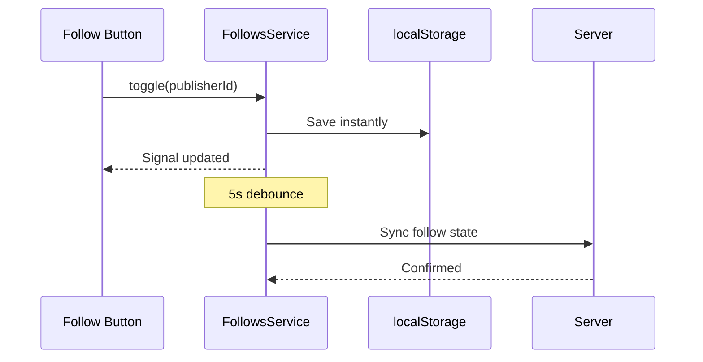

The roadbeat Mobile App provides two complementary social features: **Bookmarks** for saving content, and **Following** for tracking publishers.

## Bookmarks

Bookmarks let users save content teasers for later reading, organized into collections.

### Bookmarking Content

Users can bookmark content from multiple places:

- **Discover page** — Bookmark icon on content cards (both card and list view)
- **Content detail page** — Bookmark FAB (floating action button)
- **Publisher detail page** — Bookmark icon on publisher's content list

The bookmark toggle is **optimistic** — the UI updates immediately, and the API call happens in the background. If the API call fails, the bookmark state is rolled back.

### Bookmark Collections

Collections let users organize their bookmarks into folders:

| Feature | Description |
|---------|-------------|
| **Default collection** | All bookmarks without a collection ("Uncategorized") |
| **Custom collections** | User-created collections with custom names and descriptions |
| **Move to collection** | Move a bookmark to a different collection |
| **Collection tabs** | Filter bookmarks by collection |
| **Delete collection** | Removes the collection; bookmarks move to Uncategorized |

### BookmarksService

| Signal | Type | Description |
|--------|------|-------------|
| `bookmarks` | `Bookmark[]` | All bookmarks |
| `collections` | `BookmarkCollection[]` | All collections |
| `isLoading` | `boolean` | Loading state |
| `filteredBookmarks` | `Bookmark[]` | Bookmarks filtered by active collection (computed) |
| `bookmarkedTeaserIds` | `Set<string>` | Quick lookup set for bookmark status (computed) |
| `totalBookmarks` | `number` | Total count (computed) |

### Bookmark Model

```typescript
interface Bookmark {
  id: string;
  teaserId: string;
  title: string;
  contentType: string;
  imageUrl?: string;
  publisherName?: string;
  collectionId?: string;
  createdAt: string;
}
```

## Following Publishers

Users can follow publishers to prioritize their content in the Discover feed.

### Follow Mechanics

- **Follow button** — Appears on publisher list cards and publisher detail pages
- **Optimistic toggle** — Follow/unfollow updates instantly in the UI
- **localStorage primary** — Follow state is stored locally first for instant access
- **Server sync** — Changes are debounced (5 seconds) and synced to the server
- **Union merge** — On app startup, local and server follow lists are merged (no data loss)

### FollowsService

| Signal | Type | Description |
|--------|------|-------------|
| `followedIds` | `Set<string>` | Set of followed publisher IDs |
| `followCount` | `number` | Total follows (computed) |

| Method | Description |
|--------|-------------|
| `isFollowing(id)` | Check if a publisher is followed |
| `follow(id)` | Follow a publisher |
| `unfollow(id)` | Unfollow a publisher |
| `toggle(id)` | Toggle follow state |
| `loadFromServer()` | Sync with server (union merge) |

### Follow Data Flow



## Publishers

The publisher directory lets users discover and explore content publishers.

### Publisher List

The `PublisherListPage` displays publishers with:

- Publisher name and avatar
- Publisher type badge
- Content count
- Follow/unfollow button
- Tap to view publisher detail

### Publisher Detail

The `PublisherDetailPage` shows:

- Publisher profile information (name, avatar, description)
- Follow button with follower count
- Content grid — all content from this publisher
- Trust badge — 4-level trust verification display

### PublishersService

| Signal | Type | Description |
|--------|------|-------------|
| `publishers` | `Publisher[]` | Search results |
| `detail` | `Publisher \| null` | Active publisher detail |
| `detailContent` | `Teaser[]` | Publisher's content |
| `isLoading` | `boolean` | Loading state |
| `total` | `number` | Total publisher count |

## Trust Badges

The `TrustBadgeComponent` displays a 4-level trust verification system:

| Level | Label | Meaning |
|-------|-------|---------|
| **1** | Unverified | No verification performed |
| **2** | Email Verified | Email address confirmed |
| **3** | Identity Verified | Government ID or domain verification |
| **4** | Organization Verified | Registered organization with verified credentials |

Trust badges appear on publisher cards, publisher detail pages, and content detail pages to help users assess the credibility of content sources.
