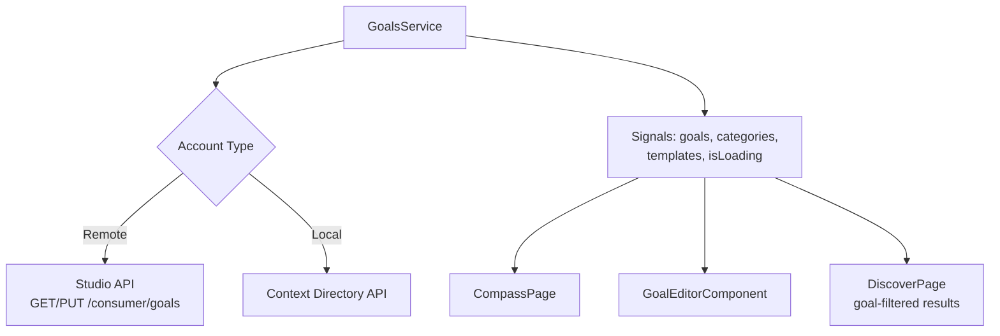

The **Compass** is roadbeat's personal goal management system. Users define what they want to achieve, and the entire content discovery experience adapts to surface relevant content that matches their goals.

## Overview

The Compass tab provides:

- **Goal categories** with emoji icons and progress tracking
- **Goal templates** for quick goal creation
- **Time horizon filtering** (Life, Year, Month, Week, Day)
- **Goal editor** with a 5-step wizard
- **Category detail views** with per-goal management

## Goal Categories

Goals are organized into categories, each displayed as a card with:

- Emoji icon and category name
- Number of goals in the category
- Progress ring showing completion

<Callout kind="tip">
  Categories are loaded from the Context Directory and can be customized per deployment. Common categories include Health, Career, Learning, Travel, Finance, and Relationships.
</Callout>

## Time Horizon Tabs

Goals can be filtered by their time horizon using pill-style tabs at the top of the Compass page:

| Horizon | Description | Example |
|---------|-------------|---------|
| **All** | Show all goals | — |
| **Life** | Long-term life goals | "Learn to play piano" |
| **Year** | Annual goals | "Visit 5 new countries" |
| **Month** | Monthly goals | "Read 3 books" |
| **Week** | Weekly goals | "Exercise 4 times" |
| **Day** | Daily goals | "Meditate for 10 minutes" |

## Goal Editor

The goal editor is a 5-step wizard presented as a bottom sheet on mobile:

<Steps>
  <Step title="Select Category">
    Choose a goal category from a 2-column grid of category cards with emoji icons.
  </Step>
  <Step title="Pick Template">
    Select a pre-defined goal template or create a custom goal. Templates come with parameter placeholders (e.g., "Learn {language} to {level}").
  </Step>
  <Step title="Fill Parameters">
    Complete the dynamic parameter form. Fields are generated from the template definition — text inputs, number inputs, or select dropdowns.
  </Step>
  <Step title="Set Time Horizon">
    Choose when to achieve this goal: Life, Year, Month, Week, or Day.
  </Step>
  <Step title="Review & Confirm">
    Review the complete goal text with filled parameters. Confirm to save.
  </Step>
</Steps>

## Goal Data Flow



## GoalsService

The `GoalsService` manages all goal-related state:

| Signal | Type | Description |
|--------|------|-------------|
| `goals` | `Goal[]` | All user goals |
| `categories` | `GoalCategory[]` | Available goal categories |
| `templates` | `GoalTemplate[]` | Templates for the active category |
| `isLoading` | `boolean` | Loading state |
| `error` | `string \| null` | Error message |
| `activeHorizonFilter` | `TimeHorizon \| 'all'` | Active filter |
| `filteredGoals` | `Goal[]` | Goals filtered by horizon (computed) |
| `goalsByCategory` | `Map` | Goals grouped by category (computed) |

## Goal-Aligned Discovery

Goals directly influence content discovery. When the user searches on the Discover page, the API uses their goal portfolio to:

- **Score relevance** — Content matching goal keywords ranks higher
- **Show "Why seeing this?"** — Explains which goals a piece of content matches
- **Goal group tabs** — Filter discover results by goal category
- **Random mode** — Discover serendipitous content within a goal group

## Optimistic Updates

Goal operations use optimistic updates for instant UI feedback:

```typescript
async addGoal(dto: CreateGoalDto): Promise<void> {
  const newGoal = { id: crypto.randomUUID(), ...dto };
  const prev = this._goals();
  this._goals.update(goals => [...goals, newGoal]);  // Instant UI update

  try {
    await this.savePortfolio();  // Persist to server
    this.toast.success('Goal added');
  } catch {
    this._goals.set(prev);  // Rollback on failure
    this.toast.error('Failed to add goal');
  }
}
```
