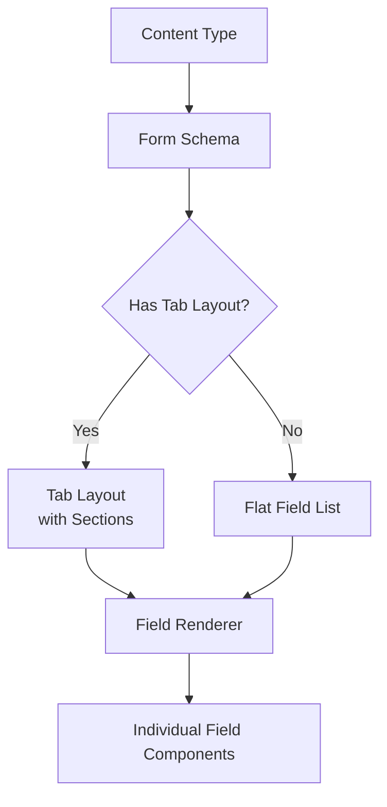
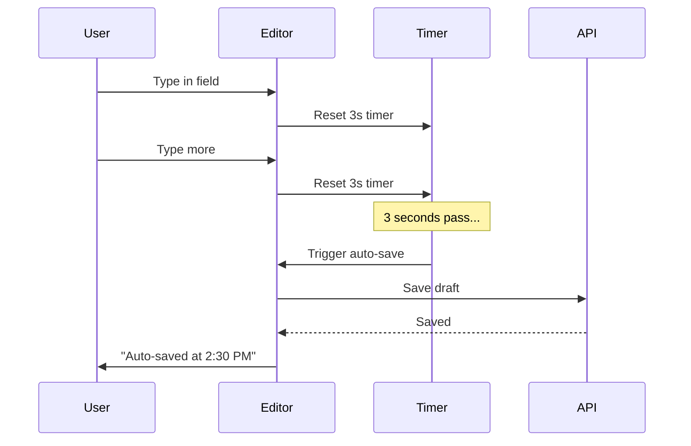

The **Content Editor** is the heart of the Mobile Studio. It renders dynamic forms from content type schemas, supports 40+ field types, auto-saves drafts, and provides a mobile-optimized rich text editing experience.

## Schema-Driven Forms

The editor dynamically builds its form from the content type's **form schema**. When a schema defines a tab layout, the editor renders swipeable tabs with collapsible sections. Otherwise, it falls back to a flat field list.



## Supported Field Types

The editor supports over 40 field types, mapped to mobile-optimized input components:

### Text Fields

| Field Type | Component | Features |
|-----------|-----------|----------|
| `text` | `IonInput` | Single-line text |
| `multilingual_text` | `IonInput` + locale selector | Text with language variants |
| `textarea` | `IonTextarea` | Multi-line text |
| `multilingual_textarea` | `IonTextarea` + locale selector | Multi-line with language variants |
| `structured_text` | Rich text editor | WYSIWYG with mobile toolbar |
| `slug` | `IonInput` | Auto-generated from title |
| `email` | `IonInput[type=email]` | Email validation |
| `url` | `IonInput[type=url]` | URL validation |
| `phone` | `IonInput[type=tel]` | Phone number |

### Data Fields

| Field Type | Component | Features |
|-----------|-----------|----------|
| `number` | `IonInput[type=number]` | Numeric input |
| `currency` | `IonInput` + currency symbol | Monetary values |
| `boolean` | `IonToggle` | On/off toggle |
| `date` | `IonInput[type=date]` | Date picker |
| `datetime` | `IonInput[type=datetime-local]` | Date and time |
| `color` | Color picker | Hex color selection |

### Selection Fields

| Field Type | Component | Features |
|-----------|-----------|----------|
| `select` | `IonSelect` | Single choice dropdown |
| `multi_select` | `IonSelect[multiple]` | Multiple choice |
| `tag_input` | Tag input component | Free-form tags |

### Complex Fields

| Field Type | Component | Features |
|-----------|-----------|----------|
| `location` | Location picker | GPS auto-fill, address search |
| `location_with_search` | Location picker + search | Address autocomplete |
| `image` | Image picker | Camera, gallery, or file upload |
| `gallery` | Gallery picker | Multi-image selection |
| `file` | File picker | Document upload |
| `reference` | Reference picker | Link to other content items |
| `repeater` | Repeatable group | Add/remove/reorder field groups |
| `modular_blocks` | Block editor | Mix different block types |
| `subform` | Nested form | Embedded sub-schema |
| `opening_hours` | Hours editor | Weekly schedule |
| `seo_meta` | SEO form | Title, description, keywords |
| `person` | Person form | Name, role, contact |
| `year_range` | Range picker | Start/end year |
| `virtual_location` | URL input | Online event/meeting link |
| `recurrence` | Recurrence editor | Repeating event patterns |
| `org_editor` | Organization form | Org name, type, details |

## Auto-Save

The editor implements debounced auto-save (3 seconds):



- Every field change resets the debounce timer
- After 3 seconds of inactivity, the content is saved as a draft
- The save indicator shows "Auto-saved at {time}"
- For new content, the first auto-save creates the item; subsequent saves update it

## Slug Auto-Generation

When creating new content, the slug is automatically generated from the title:

```typescript
// "My Travel Blog Post" → "my-travel-blog-post"
const slug = title.toLowerCase()
  .replace(/[^a-z0-9]+/g, '-')
  .replace(/^-|-$/g, '');
```

The slug field remains editable for manual customization.

## Editor Actions

The editor provides an action sheet (bottom sheet) with context-aware options:

| Action | Available | Description |
|--------|-----------|-------------|
| **Save Draft** | Always | Immediately save current state |
| **Publish** | Existing items | Publish the content item |
| **Delete** | Existing items | Delete with confirmation |
| **Cancel** | Always | Discard and go back |

## Rich Text Editor

The rich text editor is optimized for mobile with the toolbar at the bottom of the screen (above the keyboard):

### Formatting Options

| Feature | Button | Description |
|---------|--------|-------------|
| **Bold** | **B** | Bold text |
| **Italic** | *I* | Italic text |
| **Underline** | U̲ | Underlined text |
| **Strikethrough** | ~~S~~ | Strikethrough text |
| **Heading 2** | H2 | Section heading |
| **Heading 3** | H3 | Subsection heading |
| **Heading 4** | H4 | Minor heading |
| **Ordered List** | 1. | Numbered list |
| **Unordered List** | • | Bullet list |
| **Link** | 🔗 | Insert/edit hyperlink |
| **Image** | 📷 | Insert image from camera/gallery |
| **Blockquote** | " | Quoted text |
| **Code Block** | `</>` | Monospace code |

## Content Versions

The editor supports version history:

- **Version list** — Browse all versions of a content item
- **Version detail** — View the data snapshot of any version
- **Restore** — Copy a previous version's data back to the current item
- **Auto-versioning** — Version number increments on each save

In remote mode, versions are stored via the Studio API. In local mode, versions are stored in the SQLite `content_versions` table.

## Tab Layout

When a content type's form schema defines a tab layout, the editor renders tabs using Ionic's accordion groups:

```
┌──────────────────────────────────────┐
│ [General] [Details] [SEO] [Media]    │  ← Swipeable tabs
├──────────────────────────────────────┤
│ ▼ Basic Information                  │  ← Collapsible section
│   Title: [________________]          │
│   Slug:  [auto-generated__]          │
│   Locale: [EN ▼]                     │
│                                      │
│ ▼ Content Body                       │
│   [Rich text editor area...]         │
│                                      │
│ ▶ Advanced Options (collapsed)       │  ← Collapsed by default
├──────────────────────────────────────┤
│ Draft · Auto-saved 2 min ago         │
│ [Save Draft]        [Preview] [...]  │
└──────────────────────────────────────┘
```
