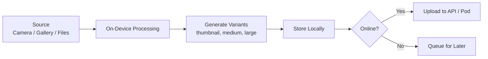

The Content tab provides full CMS capabilities — browse content types, manage content items with filters and sorting, and maintain an asset library with camera integration.

## Content Types

Content types define the structure of your content. Each type has:

- **Metadata schema** — Name, description, icon, category
- **Form schema** — Field definitions with types, validation, and layout
- **Teaser schema** — How to generate a discovery teaser

### Content Type List

The `ContentTypeListPage` displays all available content types with:

- Emoji icon (mapped from a 50+ type icon map)
- Resolved i18n name (extracted from `{ en, de }` objects)
- Content count per type
- Tap to view content items of that type

### Importing from Schema Registry

The `RegistryBrowserPage` provides a full-screen browser for importing content types from the roadbeat Schema Registry:

<Steps>
  <Step title="Open Registry Browser">
    Tap "Import from Registry" on the Content Types page.
  </Step>
  <Step title="Browse & Search">
    Browse by category or search for specific content types. The registry contains 140+ pre-defined types.
  </Step>
  <Step title="One-Click Import">
    Tap a content type to import it. The app fetches the metadata, form, and teaser schemas and saves them locally (SQLite) or via the Studio API (remote mode).
  </Step>
</Steps>

### i18n Name Resolution

Content type names, descriptions, and categories from the API may be i18n objects rather than plain strings. The `ContentTypesService` normalizes these on load:

```typescript
function resolveContentTypeName(raw: any): string {
  if (typeof raw === 'string') return raw;
  if (raw && typeof raw === 'object') {
    return raw['en'] || raw['de'] || Object.values(raw)[0] || '';
  }
  return '';
}
```

### Icon Mapping

Content type icons are mapped from raw API data (which may be `.png` filenames) to emoji using a built-in map:

| Content Type | Emoji | Content Type | Emoji |
|-------------|-------|-------------|-------|
| `news` | 📰 | `event` | 📅 |
| `blog_post` | 📝 | `recipe` | 🍳 |
| `job` | 💼 | `real_estate` | 🏠 |
| `product` | 🛍️ | `course` | 🎓 |
| `photo` | 📸 | `video` | 🎬 |
| `podcast` | 🎙️ | `review` | ⭐ |

## Content List

The `ContentListPage` displays content items for a specific content type with:

- **View modes** — List (compact) and Cards
- **Filters** — Status (draft/published/archived), locale, search query
- **Sort** — By updated date, created date, or title
- **Status badges** — Draft (gray), Published (green), Archived (yellow)
- **Pull-to-refresh** — Reset and reload the list
- **Swipe actions** — Edit, delete, publish/unpublish
- **Empty state** — "Create your first content" CTA
- **FAB** — Floating action button for quick create

### Content Item Actions

| Action | Trigger | Description |
|--------|---------|-------------|
| **Edit** | Tap item or swipe right | Opens the content editor |
| **Delete** | Swipe left | Confirms, then deletes with optimistic update |
| **Publish** | Swipe action | Publishes the content item |
| **Unpublish** | Swipe action | Reverts to draft status |

## Content Detail

When a user taps a teaser card on the Discover page, they navigate to the `ContentDetailPage` at `/tabs/detail/:teaserId`. This page:

- Fetches the full content from the Studio API or Discovery Node
- Displays a hero image with content type badge
- Shows publisher info, publication date, and location
- Renders the body as HTML
- Displays a media gallery, tags, and goal matches
- Provides bookmark toggle and native share actions

## Asset Library

The `AssetsPage` manages media files with:

- **Grid/list view** toggle
- **Folder navigation** — Create and browse folders
- **Upload sources** — Camera (photo/video), gallery (single/multi-select), files
- **Asset card** — Thumbnail, filename, size, type icon
- **Asset detail** — Full preview, metadata, usage info, alt text editing
- **Storage indicator** — Usage display for local mode
- **Delete** — With confirmation dialog

### Upload Pipeline



### Image Variants

When an image is captured or selected, the app generates multiple variants:

| Variant | Max Width | Purpose |
|---------|-----------|---------|
| **Thumbnail** | 200px | List views, grids |
| **Medium** | 800px | Content cards, previews |
| **Large** | 1920px | Full-screen display |
| **Original** | As captured | Archival, download |

All variants are JPEG compressed at 85% quality with optional EXIF location stripping.
