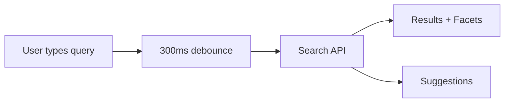
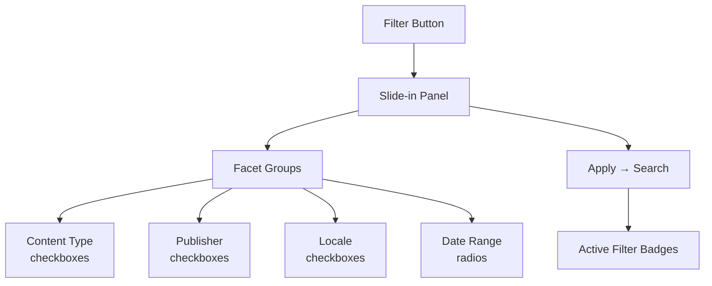

The **Discover** page is the primary content consumption experience. It presents goal-aligned content from Discovery Nodes with powerful search, filtering, and browsing capabilities.

## Overview

The Discover page combines:

- **Search bar** with autocomplete suggestions and recent searches
- **Goal group tabs** for filtering by goal category
- **Faceted filters** in a slide-in panel
- **Multiple view modes** — Cards, List, Calendar, Map
- **Sort controls** — by relevance, date, or title
- **Infinite scroll** with pull-to-refresh

## Search

The `SearchBarComponent` provides:

- **Debounced input** (300ms) to avoid excessive API calls
- **Autocomplete suggestions** from the API
- **Recent searches** stored locally
- **Clear button** to reset the query

## Goal Tabs

The `GoalTabsComponent` provides horizontally scrollable goal group pills above the results:

| Button | Behavior |
|--------|----------|
| **All** | Browse all content, no goal filtering |
| **Goal Group Pills** | Filter by a specific goal category |
| **Random** | Discover serendipitous content within the active goal group |

Goal tabs pass `goalGroupId`, `goalId`, `random`, and `browseAll` parameters to the search API.

## View Modes

The `ViewModeToggleComponent` supports four view modes:

| Mode | Icon | Description |
|------|------|-------------|
| **Cards** | Grid | Large cards with hero image, title, description, badge, and bookmark |
| **List** | List | Compact rows with thumbnail, title, publisher, and bookmark |
| **Calendar** | Calendar | Month grid showing content by publication date |
| **Map** | Map | Geographic map with content pins (placeholder) |

## Filter Panel

The `FilterPanelComponent` slides in from the right (75% screen width) and displays faceted filters:

- **Content type** — Checkbox list of available content types with counts
- **Publisher** — Filter by specific publishers
- **Locale** — Filter by content language
- **Date range** — Filter by publication date
- **Active filters** — Displayed as dismissible badge pills above results

## Sort Controls

The `SortControlsComponent` provides:

| Sort Field | Description |
|------------|-------------|
| **Relevance** | Goal-match score (default) |
| **Date** | Publication date |
| **Title** | Alphabetical |

Each field can be sorted ascending or descending.

## Content Cards

### Full Card (`ContentCardComponent`)

Displays in card view mode with:

- Hero image (lazy loaded)
- Content type badge
- Bookmark toggle button (filled/outline icon)
- Title and description
- Publisher name

### Compact Card (`ContentCardCompactComponent`)

Displays in list view mode with:

- Small thumbnail
- Title and content type
- Publisher name
- Bookmark toggle

Both cards emit `select` and `toggleBookmark` events. Clicking a card navigates to the [Content Detail](/features/content-management#content-detail) page.

## DiscoverStateService

The central state management service for the Discover page:

| Signal | Type | Description |
|--------|------|-------------|
| `query` | `string` | Current search query |
| `results` | `Teaser[]` | Current search results |
| `total` | `number` | Total result count |
| `facets` | `FacetGroup[]` | Available filter facets |
| `suggestions` | `string[]` | Autocomplete suggestions |
| `viewMode` | `ViewMode` | Active view mode |
| `sortBy` | `SortField` | Active sort field |
| `sortOrder` | `'asc' \| 'desc'` | Sort direction |
| `isLoading` | `boolean` | Loading state |
| `filters` | `Record` | Active facet filters |
| `activeGroupId` | `string \| null` | Active goal group tab |
| `isRandom` | `boolean` | Random mode active |
| `isBrowseAll` | `boolean` | Browse-all mode active |

## Pagination

The Discover page uses **infinite scroll** via Ionic's `IonInfiniteScroll`:

- Initial load fetches 20 results
- Scrolling to the bottom triggers `loadMore()` which increments the page and appends results
- A sentinel element triggers the load before the user reaches the absolute bottom
- **Pull-to-refresh** resets to page 1 and fetches fresh results

## "Why Seeing This?"

The `WhySeeingThisComponent` is a bottom sheet that explains why a piece of content appeared in the user's feed:

- Which goals it matches
- Relevance score
- Matching criteria (keywords, content type, publisher)

<Callout kind="info">
  The "Why Seeing This?" feature helps users understand how their goals influence their content feed, building trust in the recommendation system.
</Callout>
