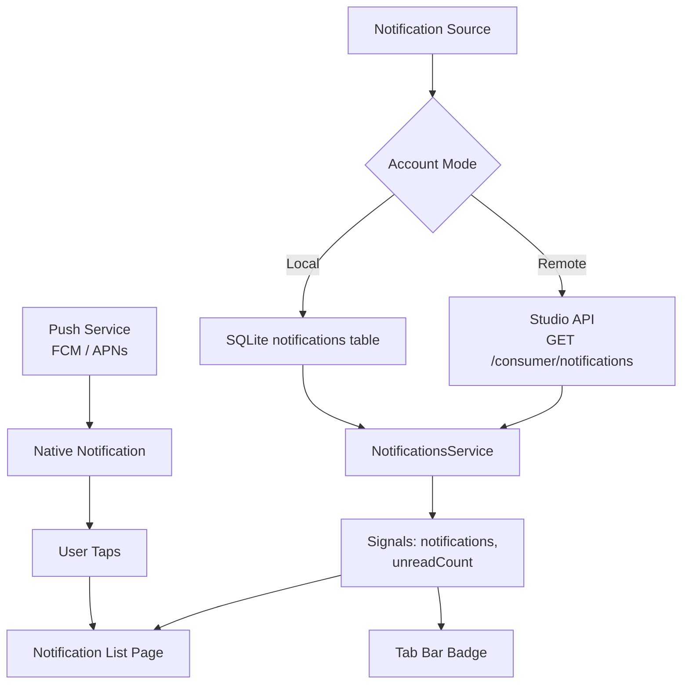

The notification system keeps users informed about content updates, publishing results, workflow tasks, and social interactions.

## Notification Types

| Type | Icon | Description |
|------|------|-------------|
| `content_published` | 📤 | Content was successfully published |
| `content_update` | 📝 | Content from a followed publisher was updated |
| `new_follower` | 👤 | Someone followed you |
| `goal_match` | 🎯 | New content matches your goals |
| `publish_failed` | ❌ | Publishing failed (with retry action) |
| `sync_complete` | ✅ | Background sync completed |
| `system` | ℹ️ | System announcements |

## Notification List

The `NotificationsPage` displays notifications in a reverse-chronological list with:

- **Notification icon** — Color-coded by type
- **Title and body** — Rich text with action links
- **Timestamp** — Relative time (e.g., "2 hours ago")
- **Read/unread state** — Unread items have a colored dot indicator
- **Swipe actions** — Swipe to mark as read or delete
- **Pull-to-refresh** — Fetch latest notifications
- **Empty state** — Friendly message when no notifications exist

### Unread Badge

The bottom tab bar shows an **unread count badge** on the Profile tab (which contains Notifications):

```typescript
readonly unreadCount = computed(() =>
  this._notifications().filter(n => !n.read).length
);
```

## NotificationsService

| Signal | Type | Description |
|--------|------|-------------|
| `notifications` | `AppNotification[]` | All notifications |
| `unreadCount` | `number` | Unread notification count (computed) |
| `isLoading` | `boolean` | Loading state |

| Method | Description |
|--------|-------------|
| `loadNotifications()` | Fetch all notifications |
| `markAsRead(id)` | Mark a single notification as read |
| `markAllRead()` | Mark all notifications as read |
| `deleteNotification(id)` | Delete a notification |
| `clearAll()` | Clear all notifications |

## Push Notifications

The app integrates with native push notification services for real-time alerts:

<Tabs>
  <Tab title="Android" icon="smartphone">
    **Firebase Cloud Messaging (FCM)**

    - Capacitor Push Notifications plugin registers with FCM on app startup
    - Device token is sent to the Studio API for server-initiated pushes
    - Notifications display as system notifications even when the app is in the background
  </Tab>
  <Tab title="iOS" icon="smartphone">
    **Apple Push Notification service (APNs)**

    - Capacitor Push Notifications plugin requests notification permission
    - Device token is registered with the Studio API
    - Rich notifications with images and action buttons
  </Tab>
</Tabs>

<Callout kind="info">
  Push notifications require a native device build. In the browser development environment, notifications are polled periodically instead of pushed.
</Callout>

## Notification Preferences

Users can customize their notification settings from the Profile → Settings page:

| Setting | Default | Description |
|---------|---------|-------------|
| **Push notifications** | On | Enable/disable all push notifications |
| **Content updates** | On | Notifications for followed publisher content |
| **Goal matches** | On | Notifications for new goal-matching content |
| **Publishing results** | On | Success/failure notifications for published content |
| **System notifications** | On | Platform announcements and updates |
| **Quiet hours** | Off | Suppress notifications during specified hours |

## Notification Data Flow


