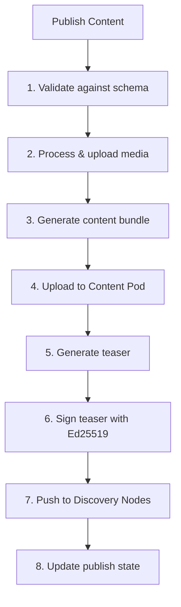
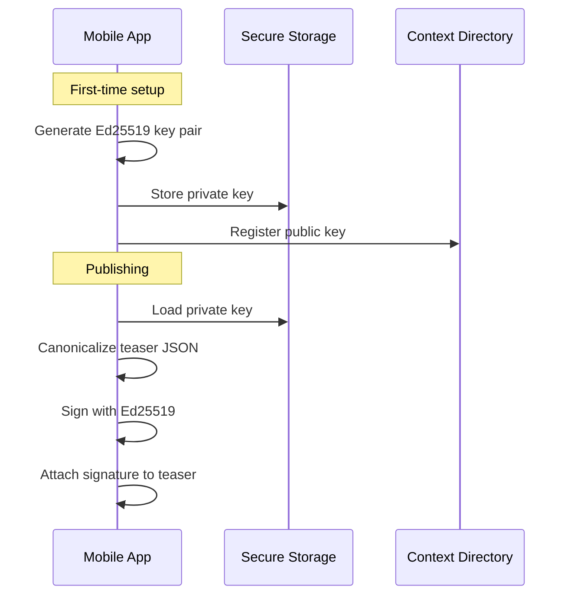

Publishing is the process of making content discoverable. The Mobile App supports a full publishing pipeline that validates content, uploads to Content Pods, signs teasers with Ed25519, and pushes them to Discovery Nodes.

## Publishing Pipeline



### Remote Mode

In remote mode, publishing is a single API call. The Studio server handles the entire pipeline:

```typescript
// Remote: delegate to Studio API
await this.http.post(
  `${studioUrl}/api/v1/manage/publishing/distribute/${contentId}`, {}
);
```

### Local Mode

In local mode, the app runs the full pipeline locally:

<Steps>
  <Step title="Validate Content">
    The content is validated against its content type schema to ensure all required fields are present and valid.
  </Step>
  <Step title="Process & Upload Media">
    All media files referenced by the content are processed (resized, compressed) and uploaded to the Content Pod.
  </Step>
  <Step title="Generate Content Bundle">
    A content bundle is created consisting of `index.json` (structured data) and `index.html` (rendered view).
  </Step>
  <Step title="Upload to Content Pod">
    The bundle is uploaded to the user's configured Content Pod (S3-compatible storage).
  </Step>
  <Step title="Generate Teaser">
    A teaser is generated from the content using the content type's teaser schema — title, description, image URL, content type, publisher info, and a link back to the Content Pod.
  </Step>
  <Step title="Sign Teaser">
    The teaser is cryptographically signed with the user's Ed25519 private key, ensuring authenticity and tamper-resistance.
  </Step>
  <Step title="Push to Discovery Nodes">
    The signed teaser is pushed to all configured Discovery Nodes, making the content searchable and discoverable.
  </Step>
  <Step title="Update Publish State">
    The local content record is updated with the Pod URL, publish timestamp, and per-node results.
  </Step>
</Steps>

## Content Signing

The `SigningService` manages Ed25519 key pairs for content signing:

- **Key generation** — Creates an Ed25519 key pair on first use
- **Secure storage** — Private key stored in Capacitor Secure Storage
- **Key registration** — Public key registered with the Context Directory
- **Teaser signing** — Signs the canonical JSON representation of each teaser



## Publish Status

The `PublishStatusPage` displays the status of publishing operations:

| Field | Description |
|-------|-------------|
| **Content title** | The item being published |
| **Current step** | Which pipeline step is active |
| **Progress** | Visual progress indicator |
| **Per-node results** | Success/failure for each Discovery Node |
| **Error details** | Error message for failed steps |
| **Retry button** | Retry failed node pushes |

### Publish Job States

| State | Description |
|-------|-------------|
| `validating` | Checking content against schema |
| `processing_media` | Processing and uploading media files |
| `generating_bundle` | Creating the content bundle |
| `uploading_pod` | Uploading to Content Pod |
| `generating_teaser` | Building the teaser from content |
| `signing` | Signing the teaser with Ed25519 |
| `pushing_nodes` | Pushing to Discovery Nodes |
| `complete` | Successfully published |
| `failed` | Publishing failed (with error details) |

## Content Pod Configuration

The `PodConfigPage` at `/tabs/publishing/pod` manages the Content Pod connection:

| Setting | Description |
|---------|-------------|
| **Endpoint URL** | S3-compatible endpoint (e.g., `https://pod.example.com`) |
| **Bucket** | Storage bucket name |
| **Access Key** | S3 access key |
| **Secret Key** | S3 secret key |
| **Public URL** | CDN URL for public access |

A **Test Connection** button verifies the configuration by attempting a lightweight S3 operation. Storage quota is displayed when available.

## Discovery Node Configuration

The `NodeConfigPage` at `/tabs/publishing/nodes` manages Discovery Node endpoints:

- **Add/remove nodes** — Configure which Discovery Nodes to publish to
- **Health check** — Ping each node to verify connectivity
- **Default selection** — Choose which node is the primary
- **Per-content-type selection** — Optionally route content types to specific nodes

<Callout kind="info">
  Discovery Nodes are federated — content pushed to one node can be discovered by users of other nodes through federation. Publishing to multiple nodes increases discoverability.
</Callout>

## Offline Publishing

When the device is offline, the publish operation is queued in the sync queue:

1. Content is validated locally (schema validation works offline)
2. Media files are stored on-device for later upload
3. A sync queue item is created with `priority: high`
4. When the device comes online, the queue processes the publish operation
5. The user is notified of success or failure via toast and notification

See [Offline & Sync](/architecture/offline-sync) for details on the sync queue.
