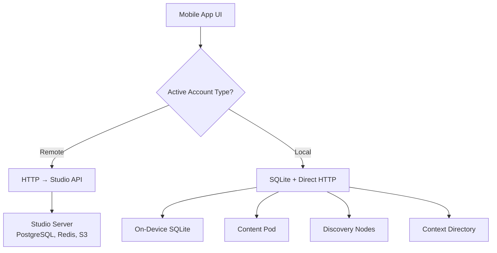
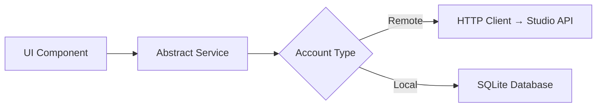
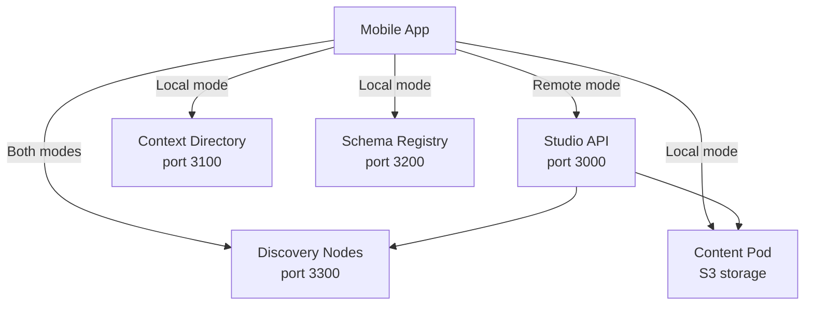

Before diving into features, it helps to understand the foundational concepts that shape how the roadbeat Mobile App works.

## Dual-Mode Architecture

The app's most important architectural decision is its **dual-mode** design. Every screen, component, and service works identically regardless of whether the user is connected to a remote Studio server or running locally with SQLite.



- **Remote mode** — The app is a thin mobile frontend. All business logic runs on the Studio server.
- **Local mode** — The app is a standalone fat-client. Content lives in SQLite, publishing goes directly to Content Pods and Discovery Nodes.

## Angular Signals

The app uses **Angular Signals** for all reactive state management — the same pattern used by the desktop Studio. There is no NgRx, no BehaviorSubjects for state — just signals and computed signals.

```typescript
// Example: BookmarksService
private readonly _bookmarks = signal<Bookmark[]>([]);
readonly bookmarks = this._bookmarks.asReadonly();
readonly bookmarkedTeaserIds = computed(() =>
  new Set(this._bookmarks().map(b => b.teaserId))
);

isBookmarked(teaserId: string): boolean {
  return this.bookmarkedTeaserIds().has(teaserId);
}
```

Every service exposes **readonly signals** that components subscribe to in templates. State mutations happen through async methods that update the private writable signal.

## Standalone Components

The entire app uses **Angular 19 standalone components** — no NgModules anywhere. Each component declares its own imports:

```typescript
@Component({
  selector: 'app-discover',
  standalone: true,
  imports: [
    IonHeader, IonToolbar, IonContent, IonSpinner,
    SearchBarComponent, ContentCardComponent,
    ViewModeToggleComponent, FilterPanelComponent,
  ],
  templateUrl: './discover.page.html',
})
export class DiscoverPage { }
```

## Abstract Data Services

UI components never know whether they're talking to a remote API or local SQLite. They consume **abstract data services** that return typed data via signals.



| Service | Remote Implementation | Local Implementation |
|---------|----------------------|---------------------|
| `ContentItemsService` | `GET/POST/PUT/DELETE /api/v1/manage/content/*` | SQLite `content` table |
| `ContentTypesService` | `GET /api/v1/manage/content-types/*` | SQLite `schemas` + Schema Registry HTTP |
| `GoalsService` | `GET/PUT /api/v1/consumer/goals/*` | Context Directory HTTP |
| `DiscoverStateService` | `POST /api/v1/consumer/discover/search` | Discovery Node HTTP |
| `BookmarksService` | `GET/POST/DELETE /api/v1/consumer/bookmarks/*` | SQLite `bookmarks` + CD sync |
| `PublishersService` | `GET /api/v1/consumer/publishers/*` | Discovery Node HTTP |

## The roadbeat Ecosystem

The Mobile App connects to several services depending on the operating mode:



| Service | Purpose | Used In |
|---------|---------|---------|
| **Studio API** | CMS backend, content CRUD, publishing | Remote mode only |
| **Context Directory** | User identity, goals, follows, geo data | Local mode (direct), Remote mode (via Studio) |
| **Schema Registry** | Content type schemas, form definitions | Local mode (direct), Remote mode (via Studio) |
| **Discovery Nodes** | Content indexing, search, publisher registry | Both modes |
| **Content Pod** | Static hosting for published content bundles | Local mode (direct), Remote mode (via Studio) |

## Content Types & Schemas

Content in roadbeat is **structured** — every piece of content conforms to a schema defined in the Schema Registry. A content type consists of:

- **Metadata schema** — Name, description, icon, category
- **Form schema** — Field definitions with types, validation, layout (tabs, sections)
- **Teaser schema** — How to generate a discovery teaser from the content

The Mobile App's content editor renders forms dynamically from these schemas, supporting 40+ field types including text, rich text, images, locations, dates, references, repeaters, and more.

## Lazy Loading

Every feature is a **lazy-loaded route**. The app shell loads instantly, and each tab's content is loaded on demand:

```typescript
{
  path: 'tabs',
  children: [
    { path: 'compass', loadComponent: () => import('./features/compass/compass.page') },
    { path: 'discover', loadComponent: () => import('./features/discover/discover.page') },
    { path: 'create', loadComponent: () => import('./features/quick-create/quick-create.page') },
    { path: 'content', loadComponent: () => import('./features/content/content.page') },
    { path: 'profile', loadComponent: () => import('./features/profile/profile.page') },
  ]
}
```

## Internationalization

The app supports **24 EU languages** using a signal-based `I18nService`:

- Locale JSON files are loaded lazily on demand
- Browser language is auto-detected on first launch
- English is the fallback for missing translations
- Content type names and descriptions support i18n objects (`{ en: "News", de: "Nachrichten" }`)

## Next Steps

<Columns cols={2}>
  <Card title="Architecture Overview" icon="layers" href="/architecture/overview">
    Deep dive into the dual-mode architecture with diagrams and code.
  </Card>
  <Card title="Features" icon="star" href="/features/compass">
    Explore the app's features starting with Compass & Goals.
  </Card>
</Columns>
