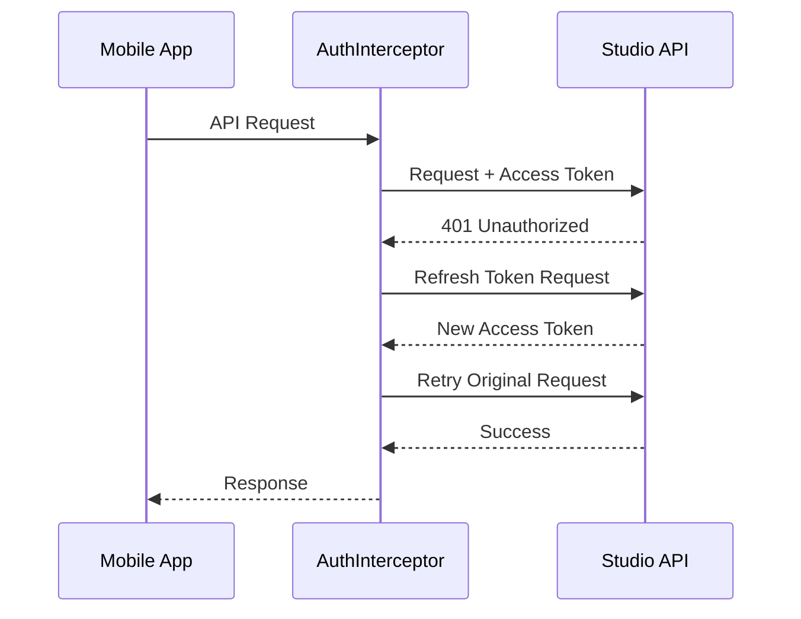

The roadbeat Mobile App supports two authentication flows depending on the account type: **remote Studio JWT authentication** and **local Context Directory authentication**.

## Remote Authentication (Studio)

When connected to a remote Studio instance, the app uses JWT-based authentication against the Studio API.

### Login Flow

<Steps>
  <Step title="Enter Credentials">
    On the Login page, enter your Studio email and password. The email may be pre-filled from the account configuration.
  </Step>
  <Step title="Authenticate">
    The app sends credentials to the Studio API:

    ```
    POST {studioUrl}/api/v1/auth/login
    Body: { email, password }
    ```
  </Step>
  <Step title="Receive Tokens">
    On success, the API returns:
    - **Access token** — Short-lived JWT for API requests
    - **Refresh token** — Long-lived token for obtaining new access tokens
  </Step>
  <Step title="Secure Storage">
    Both tokens are stored securely via Capacitor Secure Storage (Keychain on iOS, EncryptedSharedPreferences on Android).
  </Step>
  <Step title="Navigate to App">
    The router navigates to the main tabs. The `AuthGuard` now allows access.
  </Step>
</Steps>

### Token Refresh

The `AuthInterceptor` automatically handles token expiration:



If the refresh token is also expired, the user is redirected to the login page.

### Auth Interceptor

The `AuthInterceptor` attaches the JWT to all outgoing API requests:

```typescript
intercept(req, next) {
  const account = this.accountService.activeAccount();
  if (account?.type === 'remote' && account.accessToken) {
    req = req.clone({
      setHeaders: {
        Authorization: `Bearer ${account.accessToken}`
      }
    });
  }
  return next(req);
}
```

## Local Authentication (Context Directory)

In local mode, authentication is handled against the Context Directory API.

### Registration

<Steps>
  <Step title="Create Account">
    New users register with the Context Directory:

    ```
    POST {contextDirectoryUrl}/api/v1/auth/register
    Body: { displayName, email, password }
    ```
  </Step>
  <Step title="Receive Tokens">
    The CD returns JWT access and refresh tokens, plus a user ID (`cdUserId`).
  </Step>
  <Step title="Local Database Setup">
    A per-account SQLite database is created with the full schema.
  </Step>
  <Step title="Onboarding">
    The user is directed to the onboarding wizard to set location and initial goals.
  </Step>
</Steps>

### Login

Returning local users authenticate with their Context Directory credentials:

```
POST {contextDirectoryUrl}/api/v1/auth/login
Body: { email, password }
```

## Password Reset

<Steps>
  <Step title="Request Reset">
    From the Login page, tap "Forgot Password?" to open the reset form.
  </Step>
  <Step title="Enter Email">
    Enter the email associated with your account.
  </Step>
  <Step title="Check Email">
    A password reset link is sent to your email (via Studio or Context Directory, depending on account type).
  </Step>
  <Step title="Set New Password">
    Follow the link to set a new password, then return to the app and log in.
  </Step>
</Steps>

## Route Guards

Three guards protect the authenticated sections of the app:

| Guard | Check | Redirect |
|-------|-------|----------|
| `AccountGuard` | Is an active account selected? | → Account Switcher (`/accounts`) |
| `AuthGuard` | Is the user authenticated? | → Login page (`/auth/login`) |
| `OnboardingGuard` | Is onboarding complete? | → Onboarding wizard (`/onboarding`) |

Guards are applied in order on the main tabs route:

```typescript
{
  path: 'tabs',
  canActivate: [accountGuard, authGuard],
  children: [ /* ... */ ]
}
```

## Error Handling

The `ErrorInterceptor` handles HTTP error responses:

| Status | Action |
|--------|--------|
| **401** | Attempt token refresh; if that fails, redirect to login |
| **403** | Show "Access Denied" toast |
| **429** | Show "Too many requests" toast with retry delay |
| **5xx** | Show "Server error" toast; queue for offline retry if applicable |

## Security Best Practices

<Callout kind="info">
  The app follows security best practices for mobile authentication:

  - **Tokens in Secure Storage** — Never in localStorage or plain files
  - **HTTPS only** — TLS 1.3 minimum for all API communication
  - **Short-lived access tokens** — Typically 15 minutes
  - **Refresh token rotation** — New refresh token on each use
  - **Biometric unlock** — Optional fingerprint/face unlock for token access
  - **Auto-logout** — Configurable inactivity timeout
</Callout>

## Onboarding Wizard

After first login (or registration), the onboarding wizard guides new users through setup:

<Steps>
  <Step title="Welcome" icon="hand-wave">
    Introduction to roadbeat and the app's dual consumer/creator experience.
  </Step>
  <Step title="Location" icon="map-pin">
    Set your location: Country → Region → District. Used for localized content discovery and geo-based features.
  </Step>
  <Step title="Goals" icon="target">
    Choose initial goals from category templates. Select a category, pick a template, fill parameters, and set a time horizon.
  </Step>
  <Step title="Results" icon="check-circle">
    Preview your personalized content feed based on your goals and location. Confirm to complete onboarding.
  </Step>
</Steps>
