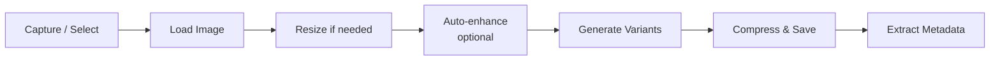

The roadbeat Mobile App provides deep camera integration and on-device media processing, making it easy to capture, process, and manage visual content directly from your device.

## Camera Integration

The `CameraService` wraps Capacitor's Camera plugin for a consistent experience across iOS and Android:

### Capture Options

| Feature | Description |
|---------|-------------|
| **Photo capture** | Full-resolution camera photos |
| **Video recording** | Video capture up to 5 minutes |
| **Gallery picker** | Select from existing photos/videos |
| **Multi-select** | Pick multiple images at once |
| **Front/rear camera** | Switch between cameras |
| **Flash control** | Auto, on, off |

### Supported Formats

<Tabs>
  <Tab title="Photos" icon="image">
    | Format | Support |
    |--------|---------|
    | JPEG | Full support (default output) |
    | PNG | Full support |
    | HEIC | Converted to JPEG on capture |
    | WebP | Full support |

    **Max resolution:** 4096 × 4096 pixels
    **Compression:** JPEG at 85% quality
  </Tab>
  <Tab title="Videos" icon="video">
    | Format | Support |
    |--------|---------|
    | MP4 | Full support (default output) |
    | MOV | Converted to MP4 |

    **Max duration:** 5 minutes (300 seconds)
    **Max resolution:** 1080p
    **Codec:** H.264 + AAC
  </Tab>
  <Tab title="Audio" icon="mic">
    | Format | Support |
    |--------|---------|
    | M4A | Full support (default output) |
    | MP3 | Full support |

    **Max duration:** 10 minutes (600 seconds)
    **Codec:** AAC at 128 kbps
  </Tab>
  <Tab title="Documents" icon="file">
    | Format | Support |
    |--------|---------|
    | PDF | Full support |
    | DOC/DOCX | Full support |

    **Max size:** 50 MB
  </Tab>
</Tabs>

## On-Device Processing

When an image is captured or selected, it goes through an on-device processing pipeline:

### Image Variants

The app generates multiple variants for different use cases:

| Variant | Max Width | Use Case |
|---------|-----------|----------|
| **Original** | As captured | Archival, full-quality download |
| **Large** | 1920px | Full-screen display, hero images |
| **Medium** | 800px | Content cards, inline images |
| **Thumbnail** | 200px | Grid views, list thumbnails |

All variants maintain the original aspect ratio and are saved as JPEG.

### EXIF Handling

| EXIF Field | Handling |
|------------|----------|
| **Orientation** | Applied and stripped (image rotated correctly) |
| **GPS Location** | Optionally stripped based on user preference |
| **Date/Time** | Preserved for content metadata |
| **Camera Model** | Preserved for media metadata |

<Callout kind="tip">
  You can configure location stripping in Settings → Privacy. When enabled, GPS data is removed from all captured images before upload.
</Callout>

## Media Library

The Asset Library (`AssetsPage`) provides a centralized view of all media files:

### Grid View

Media files displayed as a responsive thumbnail grid, grouped by date. Tap a thumbnail for full-screen preview with pinch-to-zoom.

### List View

Media files in a compact list showing:
- Thumbnail, filename, file type icon
- File size and dimensions
- Upload status indicator
- Creation date

### Folder Navigation

Organize media into folders:

- Create new folders from the toolbar
- Move files between folders via long-press → action sheet
- Navigate with breadcrumb trail at the top

### Upload Status

Each media file tracks its upload status:

| Status | Icon | Description |
|--------|------|-------------|
| **Pending** | ⏳ | Waiting to be uploaded |
| **Uploading** | 🔄 | Upload in progress |
| **Uploaded** | ✅ | Successfully uploaded to server/pod |
| **Failed** | ❌ | Upload failed (tap to retry) |

## Storage Management

In local mode, media files consume device storage. The app provides storage management tools:

### Storage Quotas

| Category | Default Limit |
|----------|--------------|
| **Media cache** | 500 MB |
| **Content cache** | 100 MB |
| **Schema cache** | 50 MB |
| **Total local** | 1 GB |

### Cleanup Policy

| Rule | Default |
|------|---------|
| **Uploaded media retention** | 30 days (originals deleted after upload) |
| **Synced content retention** | 90 days |
| **Drafts** | Always preserved (never auto-deleted) |

### Manual Cleanup

From Settings → Storage, users can:

- View storage usage breakdown by category
- Clear uploaded media (originals already on server)
- Clear discovery cache
- Clear schema cache
- See per-account storage usage

## Using Media in Content

When editing content, media fields provide multiple insertion methods:

<Steps>
  <Step title="Tap the media field">
    Tap the image/gallery/file field in the content editor.
  </Step>
  <Step title="Choose a source">
    An action sheet appears with options:
    - **Take Photo** — Opens the camera
    - **Choose from Gallery** — Opens the device photo picker
    - **Choose from Library** — Opens the roadbeat Asset Library
    - **Choose File** — Opens the file picker
  </Step>
  <Step title="Process and attach">
    The selected media is processed (resized, compressed) and attached to the content item. A thumbnail preview appears in the editor.
  </Step>
</Steps>

<Callout kind="info">
  In the rich text editor, you can also insert images inline by tapping the camera icon in the formatting toolbar.
</Callout>
