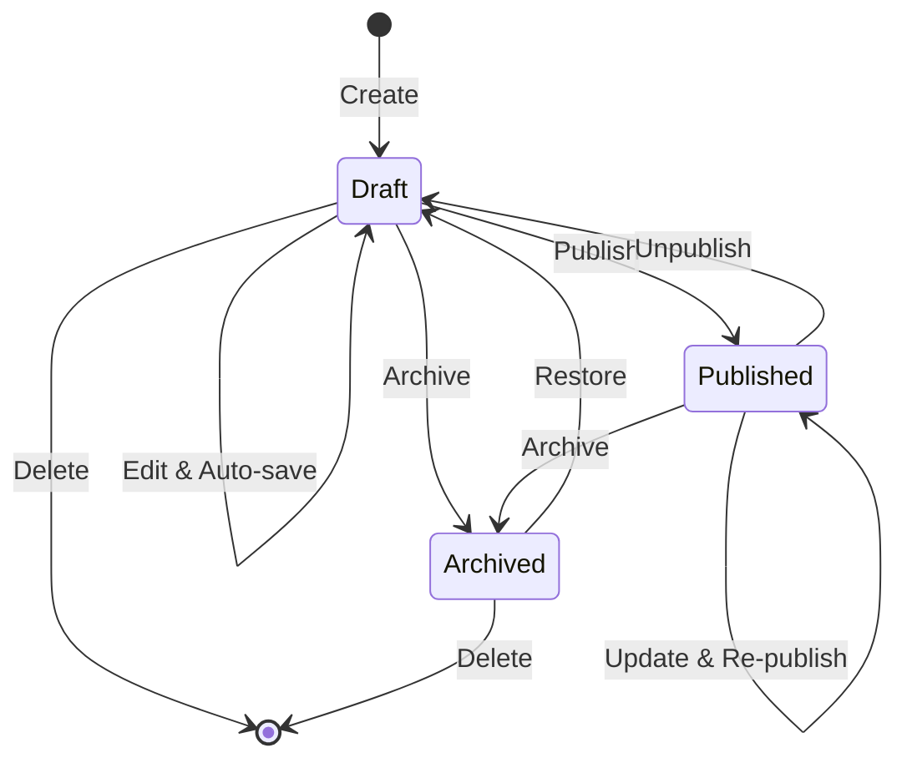

This guide walks you through the full content creation workflow — from choosing a content type to publishing your finished piece.

## Creating New Content

There are two ways to create content:

<Tabs>
  <Tab title="From Content Tab" icon="file-text">
    <Steps>
      <Step title="Navigate to Content">
        Tap the **Content** tab in the bottom navigation bar.
      </Step>
      <Step title="Select a Content Type">
        Tap on a content type from the "Content by Type" list. Each type shows its emoji icon, name, and content count.
      </Step>
      <Step title="Tap the Create Button">
        Tap the **+** floating action button to start a new content item of that type.
      </Step>
      <Step title="Fill in the Form">
        The schema-driven editor opens with fields specific to your content type. Required fields are marked with an asterisk (*).
      </Step>
      <Step title="Save or Publish">
        Tap the action menu (**...**) to save as draft or publish immediately.
      </Step>
    </Steps>
  </Tab>
  <Tab title="From Quick Create" icon="zap">
    <Steps>
      <Step title="Tap the Create Tab">
        Tap the **+** (Create) tab in the bottom navigation bar.
      </Step>
      <Step title="Choose from Recent or All Types">
        Pick from your recently used content types for fast access, or browse the full list with search.
      </Step>
      <Step title="Camera-First Option">
        For media-heavy content types, the camera opens first. Capture your photo or video, then fill in the metadata.
      </Step>
      <Step title="Quick Form">
        Only essential fields are shown initially. Expand "More Options" for additional metadata.
      </Step>
    </Steps>
  </Tab>
</Tabs>

## Working with the Editor

### Field Types

The editor adapts its fields based on the content type schema. Common field patterns:

| Field | How to Use |
|-------|-----------|
| **Title** | Tap to type. Auto-generates a slug below. |
| **Rich Text** | Tap to open the editor. Formatting toolbar appears above the keyboard. |
| **Image** | Tap to choose: Camera, Gallery, or Files. |
| **Location** | Tap the GPS icon for auto-fill, or type an address manually. |
| **Tags** | Type a tag and press Enter. Tap the × to remove. |
| **Date/Time** | Tap to open the native date picker. |
| **Select** | Tap to open the dropdown menu. |
| **Toggle** | Slide to enable/disable. |

### Auto-Save

The editor auto-saves your work every 3 seconds of inactivity. You'll see a status indicator at the bottom:

- **"Auto-saved at 2:30 PM"** — Your changes are saved
- **"Saving..."** — A save is in progress
- **"Unsaved changes"** — You have changes that haven't been saved yet

<Callout kind="tip">
  Auto-save creates a draft. Your content is not published until you explicitly choose to publish it.
</Callout>

### Tabs and Sections

Complex content types may organize fields into tabs (e.g., General, Details, SEO, Media). Swipe or tap tab headers to navigate between them. Within each tab, sections can be collapsed or expanded.

## Editing Existing Content

<Steps>
  <Step title="Find Your Content">
    Go to the **Content** tab and browse by content type, or use the search bar to find specific items.
  </Step>
  <Step title="Open for Editing">
    Tap the content item to open it in the editor.
  </Step>
  <Step title="Make Changes">
    Edit any field. Changes are auto-saved as drafts.
  </Step>
  <Step title="Publish Updates">
    If the content was already published, use the action menu to publish the updated version.
  </Step>
</Steps>

## Content Lifecycle

| Status | Description |
|--------|-------------|
| **Draft** | Work in progress, not visible to anyone |
| **Published** | Live on Discovery Nodes and Content Pod |
| **Archived** | Hidden from lists but not deleted |

## Managing Content

### Bulk Actions

From the content list, you can:

- **Long press** an item to enter multi-select mode
- Select multiple items with checkboxes
- Apply bulk actions: Delete, Archive, Publish

### Swipe Actions

On the content list, swipe items for quick actions:

- **Swipe right** — Edit the content item
- **Swipe left** — Delete (with confirmation)

### Search and Filter

The content list supports:

- **Text search** — Search by title across all content
- **Status filter** — Draft, Published, Archived
- **Content type filter** — Filter by specific content type
- **Sort** — By updated date, created date, or title

## Working Offline

Content creation works fully offline in local mode:

1. Create and edit content as normal — everything is saved to SQLite
2. Capture photos and videos — stored on the device filesystem
3. When you publish, the operation is queued in the sync queue
4. Once the device comes online, content is automatically uploaded and published
5. You're notified of success or failure

<Callout kind="info">
  In remote mode, offline editing is more limited. You can view cached content, but creating and editing requires a connection to the Studio API.
</Callout>
