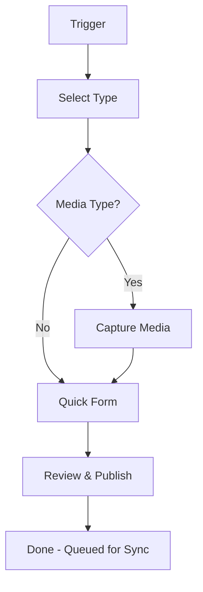

**Quick Capture** is a mobile-first content creation flow designed for speed. It's optimized for capturing moments, quick updates, and media-heavy content types — getting from idea to published content in under 60 seconds.

## Quick Capture Flow

<Steps>
  <Step title="Trigger" icon="plus-circle">
    Start Quick Capture from any of these entry points:

    - **Create tab** — Tap the ➕ tab in the bottom navigation
    - **FAB** — Floating action button on the Content or Discover pages
    - **Share intent** — Share content from another app to roadbeat

  </Step>
  <Step title="Select Content Type" icon="layout">
    Choose a content type to create:

    - **Recently Used** — Your most frequently used types appear first
    - **Search** — Type to filter the full content type list
    - **All Types** — Browse the complete list with emoji icons and descriptions

    <Callout kind="tip">
      Pin your most-used content types by using them frequently — they'll always appear at the top.
    </Callout>
  </Step>
  <Step title="Capture Media (Optional)" icon="camera">
    For media-first content types (photos, videos, events):

    - Camera opens directly for capture
    - Or pick from your photo gallery (single or multi-select)
    - Or choose files from the device

    Media is processed on-device: resized, compressed, and variant thumbnails generated.
  </Step>
  <Step title="Quick Form" icon="edit">
    Fill in the essential fields only:

    - **Title** (required for most types)
    - **Description** (optional)
    - **Location** (auto-filled from GPS if permitted)
    - **Tags** (quick tag entry)

    Tap "More Options" to expand the full form with all available fields.
  </Step>
  <Step title="Review & Publish" icon="check-circle">
    Review a preview card showing how your content will appear in discovery feeds. Then choose:

    - **Save as Draft** — Save for later editing
    - **Publish Now** — Immediately queue for publishing
    - **Schedule** — Set a future publication date (Pro feature)
  </Step>
</Steps>

## Content Type Suggestions

The Quick Create page suggests content types based on context:

| Context | Suggestion |
|---------|-----------|
| **Location-based** | Events, Check-ins, Reviews (when GPS is active) |
| **Photo captured** | Photo Posts, Social Media Posts |
| **Time of day** | Morning → Status Updates; Evening → Blog Posts |
| **Recent usage** | Your last 5 used content types |

## Share Intent

When you share content from another app (text, URL, or image) to roadbeat:

1. The Quick Capture flow opens with the shared content pre-filled
2. URLs are extracted and placed in the appropriate field
3. Shared images are attached as media
4. Shared text populates the description or body field
5. You select a content type and complete the remaining fields

## Offline Quick Capture

Quick Capture works fully offline:

- Content is saved to local storage immediately
- Media files are stored on the device filesystem
- Publishing is queued in the sync queue
- When connectivity returns, everything syncs automatically

<Callout kind="info">
  Location auto-fill uses GPS directly (no network required), so it works offline. Address lookup requires connectivity and will be filled in during sync.
</Callout>

## Quick Capture vs Full Editor

| Aspect | Quick Capture | Full Editor |
|--------|--------------|-------------|
| **Speed** | Under 60 seconds | Unlimited time |
| **Fields shown** | Essential only | All fields |
| **Layout** | Single screen | Tabs + sections |
| **Media** | Camera-first | Embedded in form |
| **Best for** | Photos, status updates, quick posts | Blog posts, articles, complex content |
| **Auto-save** | On publish only | Every 3 seconds |
